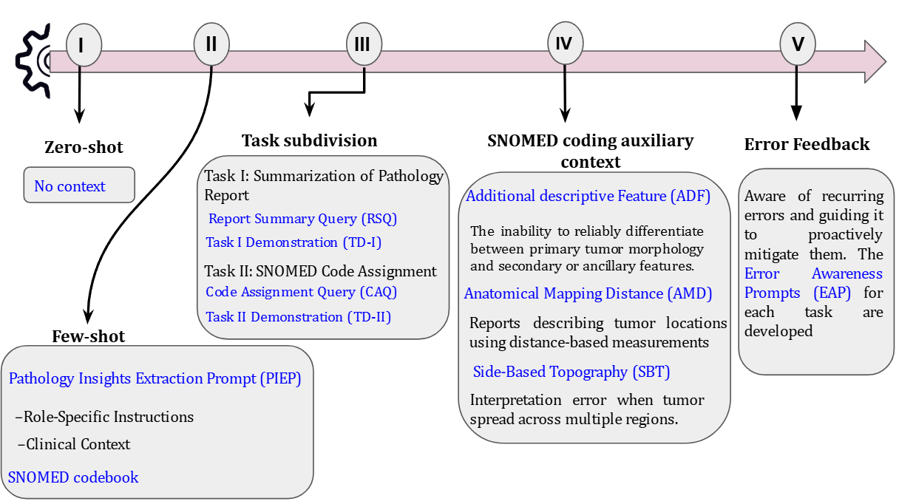
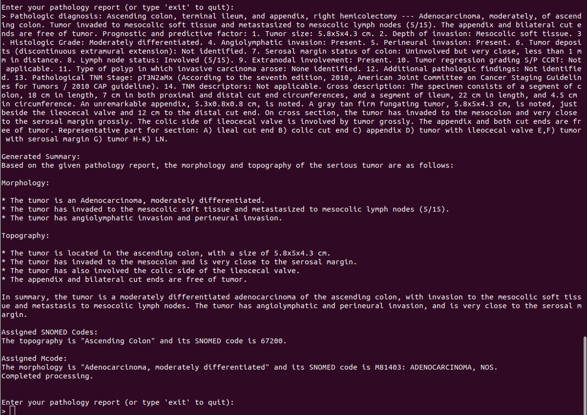
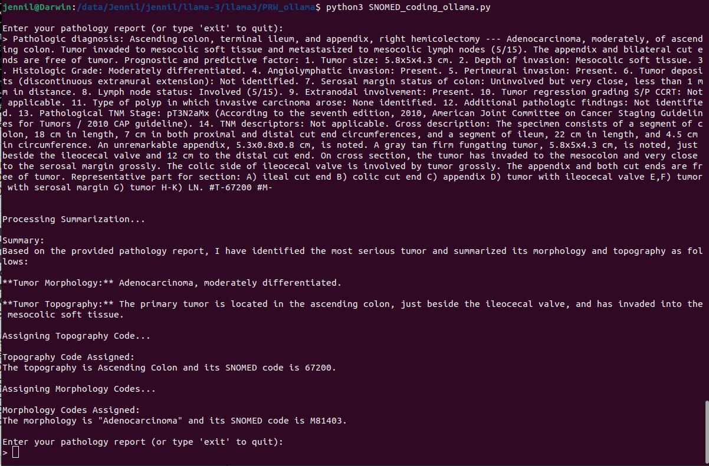
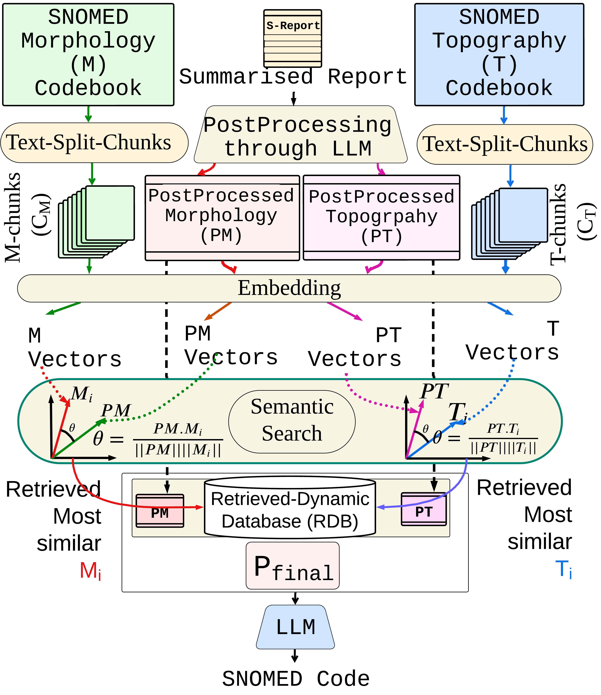
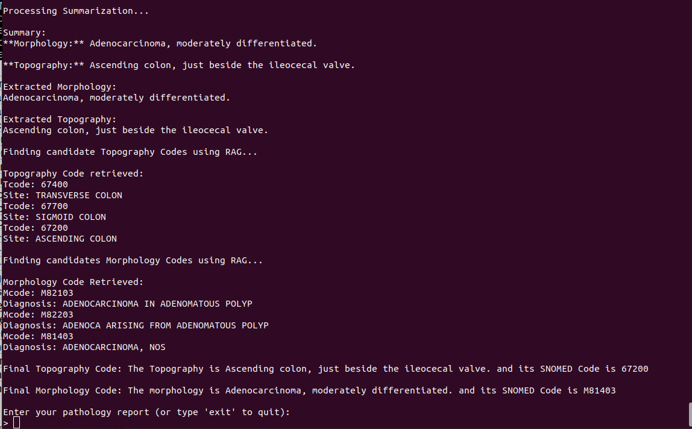

This repository comprises the  SNOMED CT(Systematized Nomenclature of Medicine Clinical Terms) coding of colon pathology reports through PRAISE (A Prompting-RAG Approach for Intelligent SNOMED Encoding Using Large Language Models).

<p align="center"><em>The development of five phases of PRAISE</em></p>
The user prompts are developed through the five phases as shown in the Figure. Each phase is developed based on addressing the error observed in the previous phase. So, in the last phase (<sup>5th</sup>), we have a comprehensive set of prompts that bring out the best of the LLaMa models in SNOMED coding.

# PRAISE (A Prompting-RAG Approach for Intelligent SNOMED Encoding Using Large Language Models)
The PRAISE framework evolved through five distinct phases, with each phase contributing to enhanced performance, ultimately leading to comprehensive results in the final phase. Due to the structured and dense user instruction nature of PRAISE, it requires LLMs with a large token capacity (≥ 4096 tokens) to effectively process complete pathology reports and ensure accurate SNOMED coding. To ensure **maximum flexibility and accessibility**, SNOMED coding has been implemented using **two different approaches**, making it adaptable to **any type of system**, whether it has **high-end GPU resources** or requires **optimized deployment on limited hardware**. These two approaches are:

- **Models provided by Meta** – Utilizes the full-scale, uncompressed LLaMa models directly from Meta for **maximum accuracy and computational power**.
- **Deployment via Ollama** – Leverages **quantized and optimized** LLaMa models through Ollama for **efficient execution on lower-resource setups** while maintaining strong performance.

Both methods ensure that **SNOMED coding can be performed seamlessly**, regardless of the **available hardware**, making the implementation **scalable, efficient, and adaptable** for a wide range of computing environments.

## SNOMED Coding with LLaMa models provided by Meta
In this approach, the LLaMa model is downloaded directly from Meta, ensuring full precision and maintaining the original number of parameters without any quantization or compression. This allows for maximum accuracy and fidelity in SNOMED coding tasks, as the model retains its full computational capability.
### Fetching Models
To obtain the model weights and tokenizer, visit the **Meta website** and agree to their license terms. Once your request is approved, Meta will send you a signed URL via email. Use this URL when prompted while executing the download script to begin the download. Ensure that `wget` and `md5sum` are installed on your system. Then, run the following command:
```bash
./download.sh
```
Note: The download links are valid for 24 hours and have a limited number of downloads. If you encounter errors such as 403: Forbidden, re-request a fresh link from Meta.

### Setting Up the Docker Container
Once the models are downloaded, you can proceed with setting up a **Docker container for PRAISE**. The `Dockerfile` is provided in: PRAISE_meta/Dockerfile


### Managing Model Files Efficiently
To optimize memory usage, **move the downloaded model and tokenizer** to a separate directory outside the project directory. Instead of storing them inside the container, dynamically reference them using the `docker run` command.

---

### Building the Docker Container
To build the container, navigate to the directory containing the `Dockerfile` and run:

```bash
docker build -t PRAISE .
```
### Running the Docker Container
Run the container while dynamically mounting the model and tokenizer using the -v flag:

```bash
docker run --gpus '"device=6,7"' --rm -it \
    -v /data/Jennil/llama3/llama3/Meta-Llama-3-8B-Instruct/:/mnt/model \
    PRAISE
```
Replace `` `/data/Jennil/llama3/llama3/Meta-Llama-3-8B-Instruct/` `` with the actual path where the model and tokenizer are stored. This approach ensures efficient memory usage while keeping the Docker container lightweight.

Once the docker starts running, you will see an interactive mode of PRAISE as shown in Figure:

<p align="center"><em> PRAISE (LLaMa models through Meta) assigning SNOMED based morphology and topography for a given colon pathology report</em></p>

## SNOMED Coding with LLaMa models deployed via Ollama

Ollama is a powerful framework designed to simplify the deployment and interaction with Large Language Models (LLMs) on local machines. It provides an efficient way to run and manage models without requiring complex cloud-based infrastructure or high-performance local GPUs. This is achieved through optimized quantized models such as GGUF-based LLaMa 2, LLaMa 3, Mistral, and Gemma, which significantly reduce memory requirements while maintaining high performance. For this work, we integrate Ollama’s LLaMa models as an alternative option to perform SNOMED coding for pathology reports, ensuring flexibility and scalability across different computing setups. To enable this, we need to set up Ollama in a Docker container with GPU support.

### Setting Up Ollama in a Docker Container
To deploy Ollama efficiently, use the following Docker command to run the container with GPU acceleration
```bash
docker run -d --gpus '"device=7"' -v ollama:/root/.ollama -p 11434:11434 --name PRAISE_ollama ollama/ollama
```
#### Understanding the Command
``--gpus '"device=7"'`` → Assigns GPU device 7 for Ollama, optimizing performance.
``-v ollama:/root/.ollama ``→ Creates and mounts a persistent volume (ollama) for storing models and configurations.
``-p 11434:11434`` → Maps port 11434 between the host and container for API access.
``--name PRAISE_ollama`` → Names the container "PRAISE_ollama" for easy reference.
``ollama/ollama`` → Specifies the Ollama Docker image to be used.

### Running the Docker Container
Once the Ollama container is successfully running, you can execute LLaMa models inside it. The following command allows you to run different LLaMa models within the container:
```bash
docker exec -it PRAISE_ollama ollama run <model_name>
```
For this study, we use the following LLaMa models in Ollama: ``llama2 ``, ``llama3``, ``llama2:13b``, ``llama2:70b``, ``llama3:70b``, ``llama3.1:8b``, ``llama3.1:70b``, ``llama3.1:405``. You can replace <model_name> in the command above with any of these models to run it inside the container.

### Starting SNOMED Coding Using Ollama
Once the model is running, you can proceed with SNOMED coding for morphology and topography of colon pathology reports. Execute the script Python PRAISE_ollama/SNOMED_coding_ollama.py

<p align="center"><em> PRAISE (LLaMa models through Ollama) assigning SNOMED based morphology and topography for a given colon pathology report</em></p>

# PRAISE-ERAG
This approach is designed to complement PRAISE when users need to work with smaller LLMs that have a token limit of less than 4096, ensuring efficient processing without compromising coding accuracy. The working of ERAG is shown in the Figure.
<p align="center">
  
</p>
<p align="center"><em> ERAG based SNOMED coding </em></p>

In the same manner as PRAISE, this approach is also handled in two ways, divided by  the nature of the LlaMa models:  models provided by Meta, and  models deployed via Ollama

## ERAG-based SNOMED Coding with models deployed via Ollama
Its components are presented in /ERAG/RAG_Ollama. 
### Building the Docker Container
Build the docker container using the dockerfile in /ERAG/Dockerfile. and build the image 
```bash
docker build -t Erag .
```
### Running the Docker Container
```bash
docker run --gpus '"device=7"' --network host -it \
-v $(pwd):/app     -v /var/run/docker.sock:/var/run/docker.sock \
-v $(which docker):/usr/bin/docker    \
--name PRAISE_RAG Erag   \
python3 /app/RAG_ollama.py
```
``--network host`` allows the container to use the host’s network directly, eliminating the need for manual port mapping. It ensures low-latency communication between the PRAISE-ERAG container and the container where LLaMa is running, making interactions faster and more efficient. ``-v /var/run/docker.sock:/var/run/docker.sock``  mounts the host’s Docker socket inside the container, allowing the container to interact with and control other running Docker containers. It enables PRAISE_RAG to execute commands within the container where LLaMa is running, facilitating seamless model invocation without requiring external API calls. ``-v $(which docker):/usr/bin/docker`` mounts the Docker CLI inside PRAISE_RAG, ensuring it can run Docker commands without installing Docker within the container.

The response of ERAG is provided in the following figure. From the figure, it can be seen that the LLM has been called multiple times to assign appropriate SNOMED codes for the given pahtology report. 

<p align="center"><em> Step-wise response of ERAG for a given pathology report </em></p>

## ERAG-based SNOMED Coding with models provided by Meta
This is the same as PRAISE where LLama models are deployed directly from the meta website. The docker file  and script are provided in /ERAG/RAG_meta/. 
