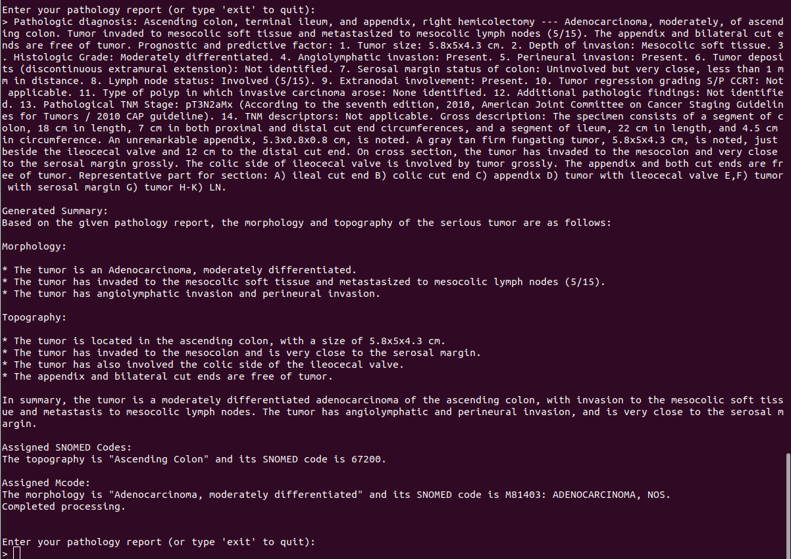

This repository comprises the  SNOMED CT(Systematized Nomenclature of Medicine Clinical Terms) coding of colon pathology reports through prompt engineering (PRW) and Enhanced-Retrieval Augmented Generation (ERAG). This study evaluated PRW and ERAG through multiple LLMs provided by Meta-Llama 2, Llama 3 and Llama 3.1. The PRW consists of five phases

<p align="center"><em>The development of five phases of PRW</em></p>
The user prompts are developed through the five phases as shown in Figure. Each phase is developed based on addressing the error observed in the previous phase. So, in the last phase (<sup>5th</sup>), we have a comprehensive set of prompts that bring out the best of the LLama models in SNOMED coding.

# SNOMED Coding through LLaMa models provided by Meta

## Fetching LLaMa Models from Meta
To obtain the model weights and tokenizer, visit the **Meta website** and agree to their license terms. Once your request is approved, Meta will send you a signed URL via email. Use this URL when prompted while executing the download script to begin the download. Ensure that `wget` and `md5sum` are installed on your system. Then, run the following command:
```bash
./download.sh
```
Note: The download links are valid for 24 hours and have a limited number of downloads. If you encounter errors such as 403: Forbidden, re-request a fresh link from Meta.

## Setting Up the Docker Container for PRW 
Once the models are downloaded, you can proceed with setting up a **Docker container for PRW**. The `Dockerfile` is provided in: PRW_Meta/Dockerfile


### Managing Model Files Efficiently
To optimize memory usage, **move the downloaded model and tokenizer** to a separate directory outside the project directory. Instead of storing them inside the container, dynamically reference them using the `docker run` command.

---

### **Building the Docker Container**
To build the container, navigate to the directory containing the `Dockerfile` and run:

```bash
docker build -t PRW .
```
### **Running the Docker Container**
Run the container while dynamically mounting the model and tokenizer using the -v flag:

```bash
docker run --gpus '"device=6,7"' --rm -it \
    -v /data/Jennil/llama3/llama3/Meta-Llama-3-8B-Instruct/:/mnt/model \
    PRW
```
Replace `` `/data/Jennil/llama3/llama3/Meta-Llama-3-8B-Instruct/` `` with the actual path where the model and tokenizer are stored. This approach ensures efficient memory usage while keeping the Docker container lightweight.

Once the docker starts running, you will see an interactive mode of PRW as shown in Figure:

<p align="center"><em> PRW (LLaMa models through Meta) assigning SNOMED based morphology and topography for a given colon pathology report</em></p>

# SNOMED Coding through LLaMa models provided by Ollama

Ollama is a powerful framework designed to simplify the deployment and interaction with Large Language Models (LLMs) on local machines. It provides an efficient way to run and manage models without requiring complex cloud-based infrastructure or high-performance local GPUs. This is achieved through optimized quantized models such as GGUF-based LLaMa 2, LLaMa 3, Mistral, and Gemma, which significantly reduce memory requirements while maintaining high performance. For this work, we integrate Ollama’s LLaMa models as an alternative option to perform SNOMED coding for pathology reports, ensuring flexibility and scalability across different computing setups. To enable this, we need to set up Ollama in a Docker container with GPU support.

## Setting Up Ollama in a Docker Container
To deploy Ollama efficiently, use the following Docker command to run the container with GPU acceleration
```bash
docker run -d --gpus '"device=7"' -v ollama:/root/.ollama -p 11434:11434 --name PRW_ollama ollama/ollama
```
#### Understanding the Command
``--gpus '"device=7"'`` → Assigns GPU device 7 for Ollama, optimizing performance.
``-v ollama:/root/.ollama ``→ Creates and mounts a persistent volume (ollama) for storing models and configurations.
``-p 11434:11434`` → Maps port 11434 between the host and container for API access.
``--name PRW_ollama`` → Names the container "PRW_ollama" for easy reference.
``ollama/ollama`` → Specifies the Ollama Docker image to be used.

## **Running the Docker Container**
Once the Ollama container is successfully running, you can execute LLaMa models inside it. The following command allows you to run different LLaMa models within the container:
```bash
docker exec -it PRW_ollama ollama run <model_name>
```
For this study, we use the following LLaMa models in Ollama: ``llama2 ``, ``llama3``, ``llama2:13b``, ``llama2:70b``, ``llama3:70b``, ``llama3.1:8b``, ``llama3.1:70b``, ``llama3.1:405``. You can replace <model_name> in the command above with any of these models to run it inside the container.

## Starting SNOMED Coding Using Ollama
Once the model is running, you can proceed with SNOMED coding for morphology and topography of colon pathology reports. Execute the script Python PRW_ollama/SNOMED_coding_ollama.py

<p align="center"><em> PRW (LLaMa models through Ollama) assigning SNOMED based morphology and topography for a given colon pathology report</em></p>


