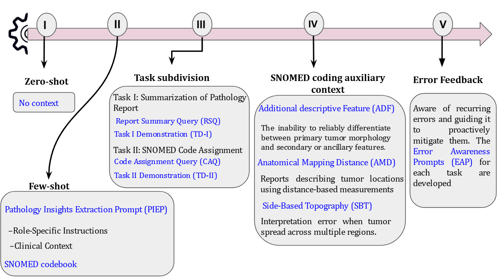

This reporsitory consiste the  SNOMED coding of colon pathology report through prompt engineering (PRW) and Enhanced-Retrieval Augmented Generaiton (ERAG). This study evaluated for PRW and ERAG through multiple LLMs provided by Meta-Llama 2, Llama 3 and Llama 3.1. The PRW consiste of five phases

